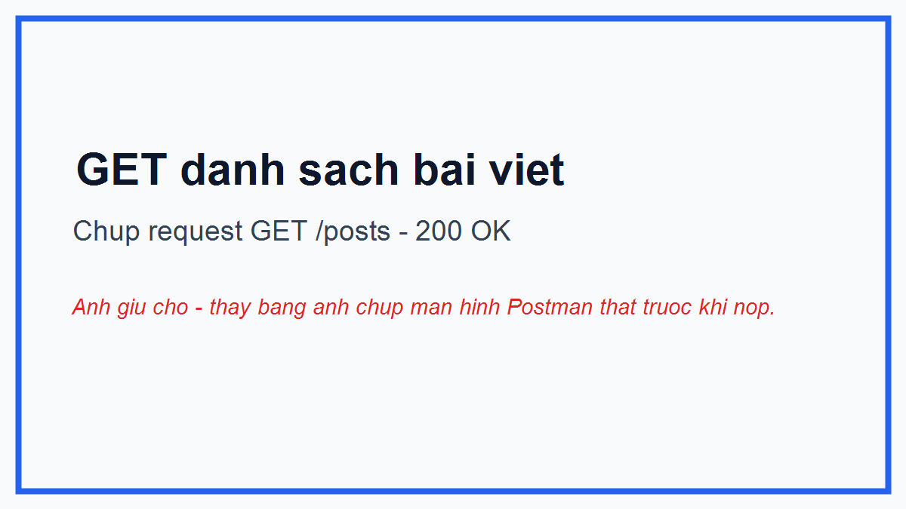
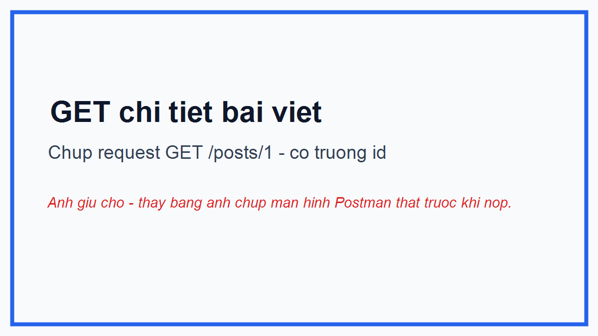
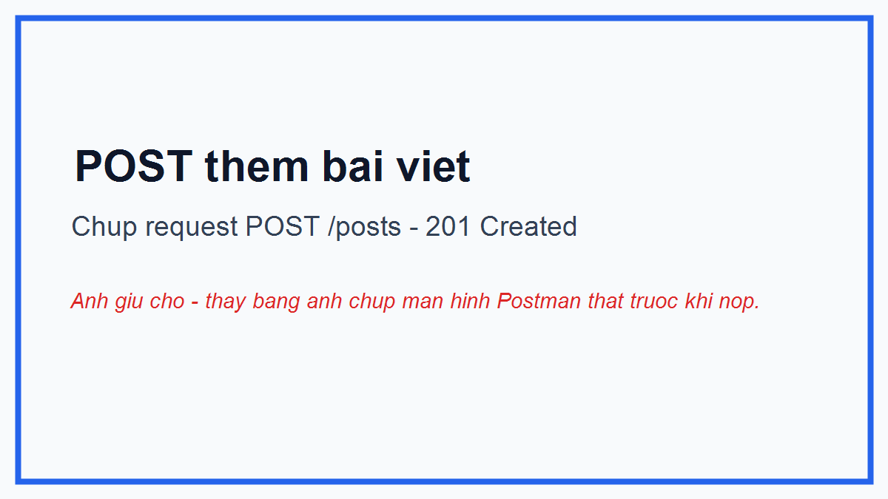
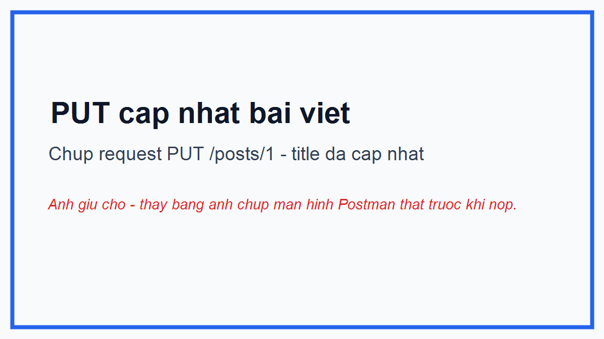
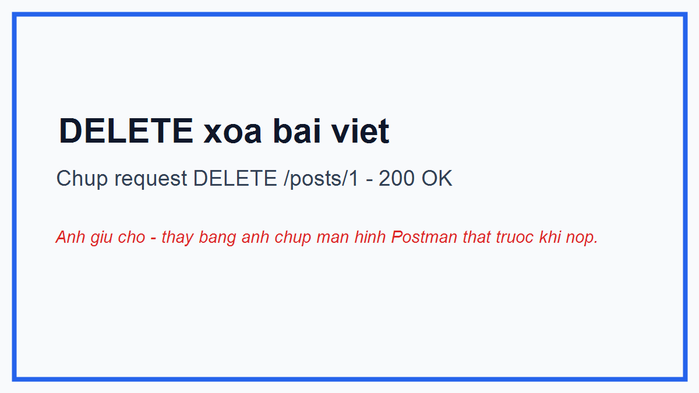
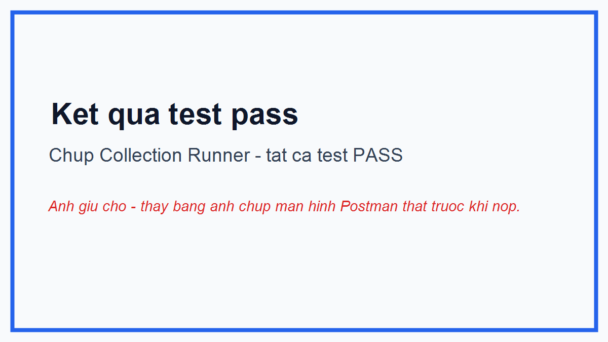

# Lab 7 - Postman

## 1. Gioi thieu ve Postman

Postman la cong cu dung de kiem thu API. Voi Postman, nguoi dung co the gui cac request nhu GET, POST, PUT, DELETE den server va xem ket qua tra ve. Cong cu nay giup kiem tra API co hoat dong dung hay khong, status code co dung khong va du lieu phan hoi co dung dinh dang mong doi khong.

Trong bai thuc hanh nay, em su dung Postman de kiem thu API mau cua JSONPlaceholder.

## 2. Muc tieu bai thuc hanh

- Lam quen voi cong cu Postman.
- Tao va gui cac request API bang Postman.
- Kiem thu cac phuong thuc GET, POST, PUT, DELETE.
- Viet test script trong Postman de kiem tra ket qua tra ve.
- Xuat Postman Collection de nop kem bao cao.
- Luu ket qua thuc hien bang hinh anh minh chung.

## 3. API su dung

API mau duoc su dung trong bai:

```text
https://jsonplaceholder.typicode.com
```

JSONPlaceholder la API gia lap, thuong duoc dung de hoc va kiem thu cac thao tac REST API.

## 4. Danh sach request da thuc hien

| STT | Ten request | Method | URL | Status mong doi |
| --- | --- | --- | --- | --- |
| 1 | GET danh sach bai viet | GET | `/posts` | 200 OK |
| 2 | GET chi tiet bai viet | GET | `/posts/1` | 200 OK |
| 3 | POST them bai viet moi | POST | `/posts` | 201 Created |
| 4 | PUT cap nhat bai viet | PUT | `/posts/1` | 200 OK |
| 5 | DELETE xoa bai viet | DELETE | `/posts/1` | 200 OK |

## 5. Chi tiet cac request

### 5.1. Request 1: GET danh sach bai viet

- Method: `GET`
- URL: `https://jsonplaceholder.typicode.com/posts`
- Body: Khong co
- Ket qua mong doi: API tra ve danh sach cac bai viet.
- Status code mong doi: `200 OK`
- Test script:

```javascript
pm.test("Status code is 200", function () {
    pm.response.to.have.status(200);
});

pm.test("Response is an array", function () {
    var jsonData = pm.response.json();
    pm.expect(jsonData).to.be.an("array");
});
```

Anh minh chung:



### 5.2. Request 2: GET chi tiet bai viet

- Method: `GET`
- URL: `https://jsonplaceholder.typicode.com/posts/1`
- Body: Khong co
- Ket qua mong doi: API tra ve thong tin chi tiet cua bai viet co id bang 1.
- Status code mong doi: `200 OK`
- Test script:

```javascript
pm.test("Status code is 200", function () {
    pm.response.to.have.status(200);
});

pm.test("Response has id field", function () {
    var jsonData = pm.response.json();
    pm.expect(jsonData).to.have.property("id");
});
```

Anh minh chung:



### 5.3. Request 3: POST them bai viet moi

- Method: `POST`
- URL: `https://jsonplaceholder.typicode.com/posts`
- Header: `Content-Type: application/json`
- Body:

```json
{
  "title": "Lab 7 Postman",
  "body": "Thuc hanh kiem thu API bang Postman",
  "userId": 1
}
```

- Ket qua mong doi: API tra ve thong tin bai viet vua duoc tao va co truong `id`.
- Status code mong doi: `201 Created`
- Test script:

```javascript
pm.test("Status code is 201", function () {
    pm.response.to.have.status(201);
});

pm.test("Response has id field", function () {
    var jsonData = pm.response.json();
    pm.expect(jsonData).to.have.property("id");
});
```

Anh minh chung:



### 5.4. Request 4: PUT cap nhat bai viet

- Method: `PUT`
- URL: `https://jsonplaceholder.typicode.com/posts/1`
- Header: `Content-Type: application/json`
- Body:

```json
{
  "id": 1,
  "title": "Cap nhat bai viet Lab 7",
  "body": "Noi dung bai viet da duoc cap nhat bang Postman",
  "userId": 1
}
```

- Ket qua mong doi: API tra ve thong tin bai viet da duoc cap nhat.
- Status code mong doi: `200 OK`
- Test script:

```javascript
pm.test("Status code is 200", function () {
    pm.response.to.have.status(200);
});

pm.test("Title is updated", function () {
    var jsonData = pm.response.json();
    pm.expect(jsonData.title).to.eql("Cap nhat bai viet Lab 7");
});
```

Anh minh chung:



### 5.5. Request 5: DELETE xoa bai viet

- Method: `DELETE`
- URL: `https://jsonplaceholder.typicode.com/posts/1`
- Body: Khong co
- Ket qua mong doi: API xoa bai viet thanh cong.
- Status code mong doi: `200 OK`
- Test script:

```javascript
pm.test("Status code is 200", function () {
    pm.response.to.have.status(200);
});
```

Anh minh chung:



## 6. Phan viet test trong Postman

Trong Postman, moi request deu co phan `Tests` de viet cac cau lenh kiem tra ket qua. Cac test trong bai nay tap trung vao:

- Kiem tra status code tra ve co dung voi yeu cau hay khong.
- Kiem tra response cua request GET danh sach co phai la mang hay khong.
- Kiem tra response cua request GET chi tiet va POST co truong `id` hay khong.
- Kiem tra request PUT co cap nhat dung gia tri `title` hay khong.

Khi chay collection, neu tat ca dieu kien deu dung thi Postman se hien ket qua test la `PASS`.

Anh ket qua test:



## 7. Ket qua thuc hien

Sau khi thuc hien cac request trong Postman, ket qua thu duoc nhu sau:

| Request | Ket qua |
| --- | --- |
| GET danh sach bai viet | Thanh cong, tra ve danh sach bai viet |
| GET chi tiet bai viet | Thanh cong, tra ve bai viet co id bang 1 |
| POST them bai viet moi | Thanh cong, tra ve status 201 va co id moi |
| PUT cap nhat bai viet | Thanh cong, tra ve noi dung da cap nhat |
| DELETE xoa bai viet | Thanh cong, tra ve status 200 |

Tat ca cac request deu co test script va co the chay bang Collection Runner trong Postman.

## 8. Huong dan chup anh minh chung

Sau khi import file `Lab7_Postman_Collection.json` vao Postman, em chay tung request va chup anh man hinh nhu sau:

1. Anh `images/get_posts.png`: Chon request `GET danh sach bai viet`, bam `Send`, chup man hinh co URL, method GET, status `200 OK` va response dang danh sach.
2. Anh `images/get_post_detail.png`: Chon request `GET chi tiet bai viet`, bam `Send`, chup man hinh co status `200 OK` va response co truong `id`.
3. Anh `images/post_create.png`: Chon request `POST them bai viet moi`, mo tab `Body`, bam `Send`, chup man hinh co body JSON, status `201 Created` va response co `id`.
4. Anh `images/put_update.png`: Chon request `PUT cap nhat bai viet`, bam `Send`, chup man hinh co status `200 OK` va title da cap nhat.
5. Anh `images/delete_post.png`: Chon request `DELETE xoa bai viet`, bam `Send`, chup man hinh co status `200 OK`.
6. Anh `images/test_result.png`: Mo Collection Runner, chay ca collection, chup man hinh ket qua cac test deu pass.

Luu y: Cac file anh trong thu muc `images` nen duoc dat dung ten nhu tren de README hien thi anh dung.

## 9. Huong dan import collection vao Postman

1. Mo Postman.
2. Chon `Import`.
3. Chon file `Lab7_Postman_Collection.json`.
4. Bam `Import`.
5. Mo collection `Lab 7 - Postman`.
6. Chay tung request bang nut `Send` hoac chay tat ca bang `Run collection`.

## 10. Huong dan tao repo GitHub va upload bai

1. Dang nhap GitHub.
2. Chon `New repository`.
3. Dat ten repo la `Lab7-Postman`.
4. Chon `Public` de giang vien co the xem.
5. Tao repo.
6. Upload cac file va thu muc sau len repo:
   - `README.md`
   - `Lab7_Postman_Collection.json`
   - Thu muc `images`
7. Kiem tra lai README tren GitHub de dam bao anh minh chung hien thi dung.

Co the upload bang giao dien GitHub hoac dung lenh Git:

```bash
git init
git add .
git commit -m "Add Lab 7 Postman report"
git branch -M main
git remote add origin https://github.com/<username>/Lab7-Postman.git
git push -u origin main
```

## 11. Huong dan nop link repo vao Google Sheet

1. Mo Google Sheet theo duong dan giang vien cung cap.
2. Tim dung dong co thong tin cua minh.
3. Dan link repo GitHub vao cot nop bai.
4. Link repo co dang:

```text
https://github.com/<username>/Lab7-Postman
```

5. Kiem tra lai quyen truy cap repo la `Public` hoac giang vien co quyen xem.

## 12. Ket luan

Qua bai thuc hanh Lab 7, em da biet cach su dung Postman de gui request API, kiem tra response, viet test script va xuat Postman Collection. Bai thuc hanh giup em hieu ro hon cach kiem thu API co ban trong kiem thu phan mem.
